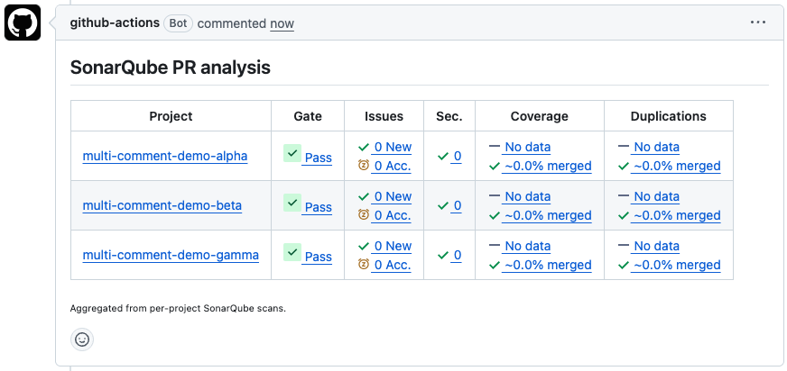

# sonarqube-multi-project-comment

Aggregate SonarQube quality-gate results from multiple projects into a
**single** PR comment — one row per project, hidden as outdated on every
re-run.

If your monorepo runs the scanner once per project (matrix build, multiple
`sonar-project.properties`, …) you usually end up with one PR comment per
project. Disable per-project PR decoration in SonarQube and use this action
instead.



## Usage

```yaml
sonar-summary:
  needs: [scan-security, scan-web, scan-api]
  if: always()
  runs-on: ubuntu-latest
  permissions:
    pull-requests: write
  steps:
    - uses: thisisnacho/sonarqube-multi-project-comment@v1
      with:
        sonar-host-url: ${{ vars.SONAR_HOST_URL }}
        sonar-token: ${{ secrets.SONAR_TOKEN }}
        projects: |
          frontend|acme-frontend
          backend|acme-backend
          services/api|acme-services-api
          agents/rag|acme-rag
```

## Data sources

The action needs to know which projects to summarise. Pick whichever fits
your pipeline — they can also be combined.

<details>
<summary><strong>1. <code>projects</code> — explicit list</strong> (simplest)</summary>

Each line is `LABEL|KEY`, or just `KEY` to use the key as the label. Requires
`sonar-host-url` and `sonar-token`.

```yaml
- uses: thisisnacho/sonarqube-multi-project-comment@v1
  with:
    sonar-host-url: ${{ vars.SONAR_HOST_URL }}
    sonar-token: ${{ secrets.SONAR_TOKEN }}
    projects: |
      frontend|acme-frontend
      backend|acme-backend
```
</details>

<details>
<summary><strong>2. <code>report-task-files</code> — auto-discover from scanner output</strong> (best for matrix builds)</summary>

Have each scan job upload its `report-task.txt` artifact, then aggregate.
The action waits for SonarQube to finish processing each scan before
querying the API for results.

```yaml
- uses: actions/download-artifact@v4
  with:
    pattern: sonar-report-*
    path: sonar-reports
- uses: thisisnacho/sonarqube-multi-project-comment@v1
  with:
    sonar-host-url: ${{ vars.SONAR_HOST_URL }}
    sonar-token: ${{ secrets.SONAR_TOKEN }}
    report-task-files: sonar-reports/**/report-task.txt
```
</details>

## Inputs

| Input | Default | Description |
| --- | --- | --- |
| `sonar-host-url` | — | Base URL of the SonarQube/SonarCloud instance. |
| `sonar-token` | — | Token used to authenticate against the SonarQube API. |
| `projects` | — | Newline- or comma-separated list of `LABEL\|KEY` (or just `KEY`). |
| `report-task-files` | — | Glob of `report-task.txt` files produced by the scanner. |
| `pr-number` | from context | Pull request number override. |
| `comment-header` | `SonarQube PR analysis` | Heading rendered above the table. |
| `icon-style` | `cloud` | Where status icons live. `cloud` matches SonarCloud's PR decoration; `community-plugin` is for self-hosted SonarQube with the community branch plugin. |
| `icon-base-url` | derived from `icon-style` | Override the icon base URL when neither default fits. |
| `footer` | `Aggregated from per-project SonarQube scans.` | Text rendered below the table inside `<sub>`. |
| `fail-on-quality-gate` | `false` | Fail the job when any gate is `ERROR`. |
| `github-token` | `${{ github.token }}` | Token used to read/write PR comments. |
| `sticky-header` | `sonarqube-aggregate` | Identifier `sticky-pull-request-comment` uses to dedupe. |
| `hide-and-recreate` | `true` | Hide the previous aggregated comment and post fresh. |
| `hide-classify` | `OUTDATED` | Classifier for GitHub's `minimizeComment` mutation. One of `OUTDATED`, `RESOLVED`, `OFF_TOPIC`, `SPAM`, `DUPLICATE`. |
| `skip-unchanged` | `false` | When `true`, skip posting if the body matches the existing comment. Defaults to `false` so re-runs always show a fresh "latest" comment. |

## Outputs

| Output | Description |
| --- | --- |
| `quality-gate` | `OK` if every project passed, otherwise `ERROR` / `NONE`. |
| `results-json` | JSON array of per-project results. |
| `body-path` | Path to the rendered comment body file. |

## Permissions

```yaml
permissions:
  contents: read
  pull-requests: write
```

## How it works

This is a composite action. It runs two steps:

1. A bundled Node sub-action (`./render`) gathers data from the SonarQube API
   and renders the markdown table.
2. [`marocchino/sticky-pull-request-comment`][sticky] posts the body and hides
   the previous aggregated comment as outdated.

[sticky]: https://github.com/marocchino/sticky-pull-request-comment

## End-to-end tests

Three Sonar workflows run against this repo:

| Workflow | Trigger | What it does |
| --- | --- | --- |
| [`sonar.yml`](.github/workflows/sonar.yml) | every PR / push to `main` | Single-project scan of the real codebase (`render/src`). Lets SonarQube post its own per-project PR decoration. |
| [`e2e-projects-list.yml`](.github/workflows/e2e-projects-list.yml) | manual + when the action source or `examples/projects/**` change | Scans the three fixtures under `examples/projects/`, then calls this action with an explicit `projects:` list. |
| [`e2e-report-tasks.yml`](.github/workflows/e2e-report-tasks.yml) | manual + when the action source or `examples/projects/**` change | Same scans, but uploads each `report-task.txt` as an artifact and calls this action with `report-task-files:` glob. |

The two E2E workflows exercise both data-source modes against a real
SonarQube instance and post aggregated comments. They use distinct
`sticky-header` values so their comments coexist on the same PR. See
[`examples/projects/README.md`](examples/projects/README.md) for the fixture
layout and prerequisites.

## Development

```sh
cd render
npm install
npm run build   # bundles src/ → render/dist/index.js with ncc
```

The bundled `render/dist/` is committed because GitHub Actions runs the
sub-action's `main` file directly.
